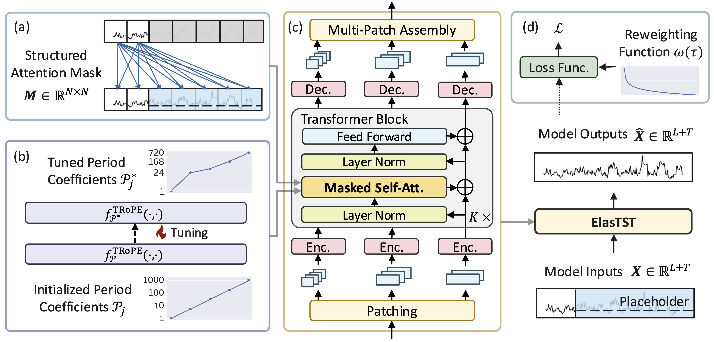

# ElasTST (NeurIPS 2024)

This `elastst` branch is the official implementation of “ElasTST: Towards Robust Varied-Horizon Forecasting with Elastic Time-Series Transformer”. It is designed to reproduce all results reported in the paper.


## Key Designs 💡

<div align=center>  </div>

ElasTST (Elastic Time-Series Transformer) is crafted to deliver robust, consistent forecasts across varied horizons. Its design leverages several unique features to ensure adaptability and accuracy:

(a) **Structured Attention Masks**: Control the flow of information by allowing placeholders to focus solely on observed time-series patches, preserving the model's horizon-invariant capability.

(b) **Tunable Rotary Position Embedding (RoPE)**: Capture customized period patterns, enabling seamless adaptation to different forecasting horizons.

(c) **Multi-Scale Patch Assembly**: Integrate fine-grained and coarse-grained information, balancing precision for short-term and long-term forecasting.

(d) **Training Horizon Reweighting**: Simulate the effects of multi-horizon sampling with a single fixed horizon, streamlining training without compromising robustness.

## Setup :wrench:

### Installation

ElasTST is developed with Python 3.10 and relies on [PyTorch Lightning](https://github.com/Lightning-AI/lightning). 

1. Clone repository:

  ```bash
  # Clone ProbTS repo
  git clone https://github.com/microsoft/ProbTS.git
  cd ProbTS

  # Switch to ElasTST branch
  git pull origin elastst:elastst
  git checkout elastst
  ```

2. Set up the environment:

  ```bash
  # Create a new conda environment
  conda create -n elastst python=3.10
  conda activate elastst

  # Install required packages
  pip install .
  ```


### Download Datasets

To download the [datasets used in our paper](https://drive.google.com/drive/folders/1ZOYpTUa82_jCcxIdTmyr0LXQfvaM9vIy), please run:
```bash
bash scripts/prepare_datasets.sh "./datasets"
```


## Quick Start :rocket:


### Running the Model

To run ElasTST, simply execute:

```bash 
bash run.sh
```

You can adjust the configuration as needed:

```bash 
python run.py --config config/elastst.yaml \
                --data.data_manager.init_args.path ./datasets \
                --trainer.default_root_dir /path/to/log_dir/ \
                --data.data_manager.init_args.dataset {DATASET_NAME} \
                --data.data_manager.init_args.context_length ${CTX_LEN} \
                --data.data_manager.init_args.prediction_length ${TEST_PRED_LEN} \
                --data.data_manager.init_args.train_pred_len_list ${TRAIN_PRED_LEN} \
                --data.data_manager.init_args.train_ctx_len_list ${TRAIN_CTX_LEN} \
                --data.data_manager.init_args.val_pred_len_list ${VAL_PRED_LEN} \

```

- `DATASET_NAME`: Select from
    ```bash 
    ['etth1', 'etth2','ettm1','ettm2','traffic_ltsf', 'electricity_ltsf', 'exchange_ltsf', 'weather_ltsf']
    ```
- `CTX_LEN`: Context length in the validation and testing phase.
- `TRAIN_CTX_LEN`: Context length in the training phase.
- `TEST_PRED_LEN`: Forecasting horizons in the testing phase.
- `VAL_PRED_LEN`: Forecasting horizons for performance validation.
- `TRAIN_PRED_LEN`: Forecasting horizons in the training phase.


### Reproducing Results

To reproduce results, use the specific config file from the [config](./config/) folder.

For baseline reproduction:
```bash 
bash scripts/run_baselines.sh
```

For ablation studies:

```bash 
bash scripts/run_ablation.sh
```


## Key Configuration Parameters for ElasTST


| **Config Name**                           | **Type**                             | **Description** |
|-------------------------------------------|--------------------------------------|-----------------|
| `data.data_manager.init_args.dataset`     | `str` | Dataset for training and evaluation. |
| `data.data_manager.init_args.context_length`    | `Union[str, int, list]`       | Length of observation window in inference phase. |
| `data.data_manager.init_args.prediction_length` | `Union[str, int, list]`       | Forecasting horizon length in inference phase. |
| `data.data_manager.init_args.val_pred_len_list` | `Union[str, int, list]`       | Forecasting horizon length for performance validation. |
| `data.data_manager.init_args.train_pred_len_list`| `Union[str, int, list]`      | Length of observation window in training phase. |
| `data.data_manager.init_args.train_ctx_len_list` | `Union[str, int, list]`      | Forecasting horizons in training phase. |
| `model.forecaster.init_args.l_patch_size` | `Union[str, int, list]`              | Patch sizes configuration. |
| `model.forecaster.init_args.k_patch_size` | `int`                                | Patch size for variables. |
| `model.forecaster.init_args.stride`       | `int`                                | Stride for patch splitting. If None, uses patch size as default. |
| `model.forecaster.init_args.rotate`       | `bool`                               | Apply rotational positional embeddings. |
| `model.forecaster.init_args.addv`         | `bool`                               | Whether to add RoPE information to value in attention. If False, only rotate the key and query embeddings. |
| `model.forecaster.init_args.bin_att`      | `bool`                               | Use binary attention biases to encode variate indices (any-variate attention). |
| `model.forecaster.rope_theta_init`        | `str`                                | Initialization for TRoPE. Options: ['exp', 'linear', 'uniform', 'rope']. |
| `model.forecaster.min_period`             | `float`                              | Minimum initialized period coefficient for rotary embeddings. |
| `model.forecaster.max_period`             | `float`                              | Maximum initialized period coefficient for rotary embeddings. |
| `model.forecaster.learn_tem_emb`          | `bool`                               | Whether to use learnable temporal embeddings. |
| `model.forecaster.learnable_rope`         | `bool`                               | Make period coefficient in TRoPE learnable. |
| `model.forecaster.abs_tem_emb`            | `bool`                               | Use absolute temporal embeddings if True. |
| `model.forecaster.structured_mask`        | `bool`                               | Apply structured mask or not. |
| `model.forecaster.max_seq_len`            | `int`                                | Maximum sequence length for the input time series. |
| `model.forecaster.theta_base`             | `int`                                | Base frequency of vanilla RoPE. |
| `model.forecaster.t_layers`               | `int`                                | Number of temporal attention layers. |
| `model.forecaster.v_layers`               | `int`                                | Number of variable attention layers. |
| `model.forecaster.patch_share_backbone`   | `bool`                               | Share Transformer backbone across patches. |
| `model.forecaster.n_heads`                | `int`                                | Number of attention heads in the multi-head attention mechanism. |
| `model.forecaster.d_k`                    | `int`                                | Dimensionality of key embeddings in attention. |
| `model.forecaster.d_v`                    | `int`                                | Dimensionality of value embeddings in attention. |
| `model.forecaster.d_inner`                | `int`                                | Size of inner layers in the feed-forward network. |
| `model.forecaster.dropout`                | `float`                              | Dropout rate for regularization during training. |
| `model.forecaster.in_channels`            | `int`                                | Number of input channels in the time series data. We only consider univariable. |
| `model.forecaster.f_hidden_size`          | `int`                                | Hidden size for the feed-forward layers. |
| `model.forecaster.use_norm`               | `bool`                               | Whether to apply instance normalization. |
| `model.forecaster.use_norm`               | `bool`                               | Whether to apply instance normalization. |
| `model.sampling_weight_scheme`            | `str`                                | The scheme of training horizon reweighting. Options: ['random', 'none', 'const'].|
| `data.data_manager.init_args.continous_sample`  | `bool`                         | If True, sampling horizons from `[min(train_pred_len_list), max(train_pred_len_list)]`, else sampling within the set `train_pred_len_list`. See `./config/ablation_study/elastst_random_sample.yaml` for details.|


## Documentation :open_book:

For detailed information on configuration parameters and model customization, please refer to the [documentation](./docs/documentation/README.md).


## Citing ElasTST 🌟

If you find ElasTST useful in your research, please cite:
```tex
@inproceedings{zhang2024elastst,
  title={ElasTST: Towards Robust Varied-Horizon Forecasting with Elastic Time-Series Transformer},
  author={Jiawen Zhang and Shun Zheng and Wen Xumeng and Xiaofang Zhou and Jiang Bian and Li Jia},
  booktitle={Advances in Neural Information Processing Systems},
  year={2024}
}
```