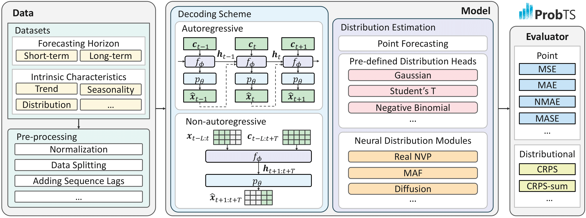

<div align=center>  </div>

# ProbTS: Benchmarking Point and Distributional Forecasting across Diverse Prediction Horizons

[](https://arxiv.org/abs/2310.07446) [](./docs/benchmark/README.md) [](./docs/documentation/README.md)


## News :tada:

:triangular_flag_on_post: **May 2025**: We have integrated [ModernTCN](https://github.com/luodhhh/ModernTCN/tree/main) into ProbTS. You can find the corresponding configuration file [here](./config/default/moderntcn.yaml).

:triangular_flag_on_post: **Apr 2025**: ProbTS now includes [Time-MoE](https://github.com/Time-MoE/Time-MoE) and offers improved support for foundation models of varying sizes. See [Foundation Models](#foundation-models) for details.

:triangular_flag_on_post: **Dec 2024**: ProbTS now supports [GIFT-EVAL](https://github.com/SalesforceAIResearch/gift-eval?tab=readme-ov-file#installation) benchmark datasets! Visit [this page](./docs/documentation/Gift_eval.md) for detailed instructions. *Please note that this feature is still in beta version and may contain bugs or inconsistencies. We will continue to update and improve it.*

:triangular_flag_on_post: **Dec 2024**: Added quick guides for benchmarking foundation models. Visit [this page](./docs/benchmark/foundation_model/README.md) for detailed instructions.

:triangular_flag_on_post: **Oct 2024**: ProbTS now includes the ElasTST model! Check out the [ElasTST branch](https://github.com/microsoft/ProbTS/tree/elastst) to reproduce all results reported in paper or run `bash scripts/run_elastst.sh` for a quick start.

:triangular_flag_on_post: **Oct 2024**: The [camera-ready version](https://arxiv.org/abs/2310.07446) of ProbTS is now available, with more in-depth analyses on the impact of normalization.

## About ProbTS :bulb:

A wide range of industrial applications desire precise point and distributional forecasting for diverse prediction horizons. ProbTS serves as a benchmarking tool to aid in understanding how advanced time-series models fulfill these essential forecasting needs. It also sheds light on their advantages and disadvantages in addressing different challenges and unveil the possibilities for future research.

To achieve these objectives, ProbTS provides a unified pipeline that implements [cutting-edge models](#-available-models) from different research threads, including:
- Supervised long-term point forecasting models, such as [PatchTST](https://arxiv.org/abs/2211.14730), [iTransformer](https://arxiv.org/abs/2310.06625), etc.
- Supervised short-term probabilistic forecasting models, such as [TimeGrad](https://arxiv.org/abs/2101.12072), [CSDI](https://arxiv.org/abs/2107.03502), etc.
- Pre-trained time-series foundation models for zero-shot forecasting, such as [TimesFM](https://arxiv.org/abs/2310.10688), [MOIRAI](https://arxiv.org/abs/2402.02592), etc.

Specifically, ProbTS emphasizes the differences in their primary methodological designs, including:
- Supporting point or distributional forecasts
- Using autoregressive or non-autoregressive decoding schemes for multi-step outputs

<div align=center>  </div>


## Available Models 🧩

ProbTS includes both classical time-series models, specializing in long-term point forecasting or short-term distributional forecasting, and recent time-series foundation models that offer zero-shot and arbitrary-horizon forecasting capabilities for new time series.

### Classical Time-series Models

| **Model** | **Original Eval. Horizon** | **Estimation** | **Decoding Scheme** | **Class Path** |
| --- | --- | --- | --- | --- |
| Linear | - | Point | Auto / Non-auto | `probts.model.forecaster.point_forecaster.LinearForecaster` |
| [GRU](https://arxiv.org/abs/1412.3555) | - | Point | AR / NAR | `probts.model.forecaster.point_forecaster.GRUForecaster` |
| [Transformer](https://arxiv.org/abs/1706.03762) | - | Point | AR / NAR | `probts.model.forecaster.point_forecaster.TransformerForecaster` |
| [Autoformer](https://arxiv.org/abs/2106.13008) | Long | Point | NAR | `probts.model.forecaster.point_forecaster.Autoformer` |
| [N-HiTS](https://arxiv.org/abs/2201.12886) | Long | Point | NAR | `probts.model.forecaster.point_forecaster.NHiTS` |
| [NLinear](https://arxiv.org/abs/2205.13504) | Long | Point | NAR | `probts.model.forecaster.point_forecaster.NLinear` |
| [DLinear](https://arxiv.org/abs/2205.13504) | Long | Point | NAR | `probts.model.forecaster.point_forecaster.DLinear` |
| [TSMixer](https://arxiv.org/abs/2303.06053) | Long | Point | NAR | `probts.model.forecaster.point_forecaster.TSMixer` |
| [TimesNet](https://arxiv.org/abs/2210.02186) | Short / Long | Point | NAR | `probts.model.forecaster.point_forecaster.TimesNet` |
| [PatchTST](https://arxiv.org/abs/2211.14730) | Long | Point | NAR | `probts.model.forecaster.point_forecaster.PatchTST` |
| [iTransformer](https://arxiv.org/abs/2310.06625) | Long | Point | NAR | `probts.model.forecaster.point_forecaster.iTransformer` |
| [ElasTST](https://arxiv.org/abs/2411.01842) | Long | Point | NAR | `probts.model.forecaster.point_forecaster.ElasTST` |
| [GRU NVP](https://arxiv.org/abs/2002.06103) | Short | Probabilistic | AR | `probts.model.forecaster.prob_forecaster.GRU_NVP` |
| [GRU MAF](https://arxiv.org/abs/2002.06103) | Short | Probabilistic | AR | `probts.model.forecaster.prob_forecaster.GRU_MAF` |
| [Trans MAF](https://arxiv.org/abs/2002.06103) | Short | Probabilistic | AR | `probts.model.forecaster.prob_forecaster.Trans_MAF` |
| [TimeGrad](https://arxiv.org/abs/2101.12072) | Short | Probabilistic | AR | `probts.model.forecaster.prob_forecaster.TimeGrad` |
| [CSDI](https://arxiv.org/abs/2107.03502) | Short | Probabilistic | NAR | `probts.model.forecaster.prob_forecaster.CSDI` |
| [TSDiff](https://arxiv.org/abs/2307.11494) | Short | Probabilistic | NAR | `probts.model.forecaster.prob_forecaster.TSDiffCond` |

### Foundation Models

| **Model** | **Any Horizon** | **Estimation** | **Decoding Scheme** | **Class Path** | **Model Size** | 
| --- | --- | --- | --- | --- | --- |
| [Lag-Llama](https://arxiv.org/abs/2310.08278) | &#x2714; | Probabilistic | AR | `probts.model.forecaster.prob_forecaster.LagLlama` | - |
| [ForecastPFN](https://arxiv.org/abs/2311.01933) | &#x2714; | Point | NAR | `probts.model.forecaster.point_forecaster.ForecastPFN` | - |
| [TimesFM](https://arxiv.org/abs/2310.10688) | &#x2714; | Point | AR | `probts.model.forecaster.point_forecaster.TimesFM` | `200m`, `500m` |
| [TTM](https://arxiv.org/abs/2401.03955) | &#x2718; | Point | NAR | `probts.model.forecaster.point_forecaster.TinyTimeMixer` | - |
| [Timer](https://arxiv.org/abs/2402.02368) | &#x2714; | Point | AR | `probts.model.forecaster.point_forecaster.Timer` | - |
| [MOIRAI](https://arxiv.org/abs/2402.02592) | &#x2714; | Probabilistic | NAR | `probts.model.forecaster.prob_forecaster.Moirai` | `small`, `base`, `large` |
| [UniTS](https://arxiv.org/abs/2403.00131) | &#x2714; | Point | NAR | `probts.model.forecaster.point_forecaster.UniTS` | - |
| [Chronos](https://arxiv.org/abs/2403.07815) | &#x2714; | Probabilistic | AR | `probts.model.forecaster.prob_forecaster.Chronos` | `tiny`, `mini`, `small`, `base`, `large` |
| [Time-MoE](https://arxiv.org/abs/2409.16040) | &#x2714; | Point | AR | `probts.model.forecaster.point_forecaster.TimeMoE` | `50M`, `200M` |

See the [tsfm configuration directory](./config/tsfm/) for more details. More models will be added soon—stay tuned!

## Setup :wrench:

### Environment

ProbTS is developed with Python 3.10 and relies on [PyTorch Lightning](https://github.com/Lightning-AI/lightning). To set up the environment:

```bash
# Create a new conda environment
conda create -n probts python=3.10
conda activate probts

# Install required packages
pip install .
pip uninstall -y probts # recommended to uninstall the root package (optional)
```

<details>

<summary>Optional for TSFMs reproducibility</summary>

For time-series foundation models, you need to install basic packages and additional dependencies:

**1. Set Up Environment**
```bash
# Create a new conda environment
conda create -n probts_fm python=3.10
conda activate probts_fm

# Git submodule
git submodule update --init --recursive

# Install additional packages for foundation models
pip install ".[tsfm]"
pip uninstall -y probts # recommended to uninstall the root package (optional)
```

**2. Initialize Submodules**
```bash
# For MOIRAI, we fix the version of the package for better performance
cd submodules/uni2ts
git reset --hard fce6a6f57bc3bc1a57c7feb3abc6c7eb2f264301

# For Lag-Llama, fix the version for reproducibility (optional)
cd submodules/lag_llama
git reset --hard 4ad82d9

# For TinyTimeMixer, fix the version for reproducibility (optional)
cd submodules/tsfm
git reset --hard bb125c14a05e4231636d6b64f8951d5fe96da1dc
```

</details>

### Datasets

For a complete dataset list, refer to the [Datasets Overview](./docs/documentation/README.md#datasets-overview).

- **Short-Term Forecasting**: We use datasets from [GluonTS](https://github.com/awslabs/gluonts). 
    Configure the datasets using `--data.data_manager.init_args.dataset {DATASET_NAME}`. You can choose from multivariate or univariate datasets as per your requirement.
    ```bash
    ['exchange_rate_nips', 'electricity_nips', 'traffic_nips', 'solar_nips', 'wiki2000_nips']
    ```

- **Long-Term Forecasting**: To download the [long-term forecasting datasets](https://drive.google.com/drive/folders/1ZOYpTUa82_jCcxIdTmyr0LXQfvaM9vIy), please follow these steps:
    ```bash
    bash scripts/prepare_datasets.sh "./datasets"
    ```

    Configure the datasets using `--data.data_manager.init_args.dataset {DATASET_NAME}` with the following list of available datasets:
    ```bash
    ['etth1', 'etth2','ettm1','ettm2','traffic_ltsf', 'electricity_ltsf', 'exchange_ltsf', 'illness_ltsf', 'weather_ltsf', 'caiso', 'nordpool']
    ```
    *Note: When utilizing long-term forecasting datasets, you must explicitly specify the `context_length` and `prediction_length` parameters. For example, to set a context length of 96 and a prediction length of 192, use the following command-line arguments:*
    ```bash
    --data.data_manager.init_args.context_length 96 \
    --data.data_manager.init_args.prediction_length 192 \
    ```

- **Using Datasets from Monash Time Series Forecasting Repository**: To use datasets from the [Monash Time Series Forecasting Repository](https://forecastingdata.org/), follow these steps:

    1. **Download the Dataset**: 
    - Navigate to the target dataset, such as the [Electricity Hourly Dataset](https://zenodo.org/records/4656140).
    - Download the `.tsf` file and place it in your local `datasets` directory (e.g., `./datasets`).

    1. **Configure the Dataset**:
    - Use the following configuration to specify the dataset, file path, and frequency:
        ```bash
        --data.data_manager.init_args.dataset {DATASET_NAME} \
        --data.data_manager.init_args.data_path /path/to/data_file.tsf \
        --data.data_manager.init_args.freq {FREQ} 
        ```

    - **Example Configuration**:
        ```bash
        --data.data_manager.init_args.dataset monash_electricity_hourly \
        --data.data_manager.init_args.data_path ./datasets/electricity_hourly_dataset.tsf \
        --data.data_manager.init_args.freq H \
        --data.data_manager.init_args.context_length 96 \
        --data.data_manager.init_args.prediction_length 96 \
        --data.data_manager.init_args.multivariate true
        ```

    *Note 1: Refer to the [Pandas Time Series Offset Aliases](https://pandas.pydata.org/pandas-docs/stable/user_guide/timeseries.html#timeseries-offset-aliases) for the correct frequency values (`{FREQ}`) to use in your configuration.*

    *Note 2: You can adjust the test instance sampling using the `--data.data_manager.init_args.test_rolling_length` parameter.*

### Checkpoints for Foundation Models

Download the checkpoints with the following command (details can be found [here](./checkpoints/README.md)):
```bash
bash scripts/prepare_tsfm_checkpoints.sh # By downloading, you agree to the original licenses
```

## Quick Start :rocket:

Specify `--config` with a specific configuration file to reproduce results of point or probabilistic models on commonly used long- and short-term forecasting datasets. Configuration files are included in the [config](./config/) folder.

To run models:
```bash 
bash run.sh
```

Experimental results reproduction:

- **Long-term Forecasting:**

    ```bash 
    bash scripts/reproduce_ltsf_results.sh
    ```


- **Short-term Forecasting:**

    ```bash 
    bash scripts/reproduce_stsf_results.sh
    ```

- **Time Series Foundation Models:**

    ```bash 
    bash scripts/reproduce_tsfm_results.sh
    ```

### Short-term Forecasting Configuration

For short-term forecasting scenarios, datasets and corresponding `context_length` and `prediction_length` are automatically obtained from [GluonTS](https://github.com/awslabs/gluonts). Use the following command:

```bash 
python run.py --config config/path/to/model.yaml \
                --data.data_manager.init_args.path /path/to/datasets/ \
                --trainer.default_root_dir /path/to/log_dir/ \
                --data.data_manager.init_args.dataset {DATASET_NAME}
```
See full `DATASET_NAME` list:
```python
from gluonts.dataset.repository import dataset_names
print(dataset_names)
```

### Long-term Forecasting Configuration

For long-term forecasting scenarios, `context_length` and `prediction_length` must be explicitly assigned:

```bash 
python run.py --config config/path/to/model.yaml \
                --data.data_manager.init_args.path /path/to/datasets/ \
                --trainer.default_root_dir /path/to/log_dir/ \
                --data.data_manager.init_args.dataset {DATASET_NAME} \
                --data.data_manager.init_args.context_length {CTX_LEN} \
                --data.data_manager.init_args.prediction_length {PRED_LEN} 
```

`DATASET_NAME` options:
```bash 
['etth1', 'etth2','ettm1','ettm2','traffic_ltsf', 'electricity_ltsf', 'exchange_ltsf', 'illness_ltsf', 'weather_ltsf', 'caiso', 'nordpool']
```

### Forecasting with Varied Prediction Lengths


Conventional forecasting models typically require specific training and deployment for each prediction horizon. However, with the growing importance of varied-horizon forecasting, there is a need for models that can deliver robust predictions across multiple inference horizons after a single training phase.

ProbTS has been updated to support varied-horizon forecasting by enabling the specification of distinct context and prediction lengths for the training, validation, and testing phases.

**Quick Start**

To quickly train and evaluate ElasTST:

```bash 
bash scripts/run_elastst.sh
```

To quickly set up varied-horizon training:

```bash 
bash scripts/run_varied_hor_training.sh
```

For detailed information on the configuration, refer to the [documentation](./docs/documentation/README.md#forecasting-with-varied-prediction-lengths).

*Note: Currently, this feature is only supported by ElasTST, Autoformer, and foundation models.*


## Benchmarking :balance_scale:

By utilizing ProbTS, we conduct a systematic comparison between studies that focus on point forecasting and those aimed at distributional estimation, employing various forecasting horizons and evaluation metrics. For more details

- [Short-term & Long-term Forecasting Benchmarking](./docs/benchmark/README.md)
- [Evaluating Time Series Foundation Models](./docs/benchmark/FOUNDATION_MODEL.md)


## Documentation :open_book:

For detailed information on configuration parameters and model customization, please refer to the [documentation](./docs/documentation/README.md).


- To print the full pipeline configuration to a file:

    ```bash
    python run.py --print_config > config/pipeline_config.yaml
    ```

## Acknowledgement 🌟

Special thanks to the following repositories for their open-sourced code bases and datasets.

### Tools/Packages

- [GluonTS](https://github.com/awslabs/gluonts)
- [PyTorch-TS](https://github.com/zalandoresearch/pytorch-ts)
- [TSLib](https://github.com/libts/tslib) 
- [NeuralForecast](https://github.com/Nixtla/neuralforecast)

### Official Implementations

**Classical Time-series Models**

- [Autoformer](https://github.com/thuml/Autoformer)
- [N-HiTS](https://github.com/cchallu/n-hits)
- [NLinear, DLinear](https://github.com/cure-lab/LTSF-Linear)
- [TimesNet](https://github.com/thuml/Time-Series-Library)
- [RevIN](https://github.com/ts-kim/RevIN)
- [PatchTST](https://github.com/yuqinie98/PatchTST)
- [iTransformer](https://github.com/thuml/iTransformer)
- [GRU NVP, GRU MAF, Trans MAF, TimeGrad](https://github.com/zalandoresearch/pytorch-ts/tree/master)
- [CSDI](https://github.com/ermongroup/CSDI)
- [TSDiff](https://github.com/amazon-science/unconditional-time-series-diffusion)


**Time-series Foundation Models**

- [MOIRAI](https://github.com/SalesforceAIResearch/uni2ts)
- [Chronos](https://github.com/amazon-science/chronos-forecasting)
- [Lag-Llama](https://github.com/time-series-foundation-models/lag-llama)
- [TimesFM](https://github.com/google-research/timesfm)
- [Timer](https://github.com/thuml/Large-Time-Series-Model)
- [UniTS](https://github.com/mims-harvard/UniTS)
- [ForecastPFN](https://github.com/abacusai/ForecastPFN)
- [TTM](https://github.com/ibm-granite/granite-tsfm)

## Citing ProbTS :beers:

If you have used ProbTS for research or production, please cite it as follows.
```tex
@inproceedings{zhang2024probts,
  title={{ProbTS}: Benchmarking Point and Distributional Forecasting across Diverse Prediction Horizons},
  author={Zhang, Jiawen and Wen, Xumeng and Zhang, Zhenwei and Zheng, Shun and Li, Jia and Bian, Jiang},
  booktitle={NeurIPS Datasets and Benchmarks Track},
  year={2024}
}
```
