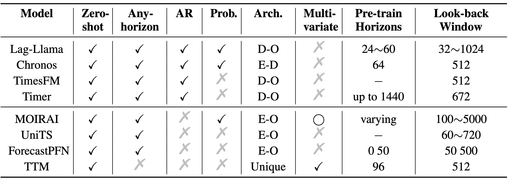
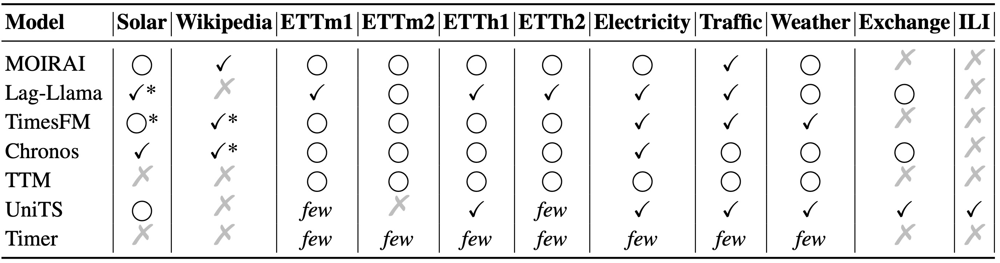

## Time Series Foundation Models Benchmarking

We have incorporated eight recently emerged time series foundation models, namely [Lag-Llama](https://github.com/time-series-foundation-models/lag-llama), [Chronos](https://github.com/amazon-science/chronos-forecasting), [TimesFM](https://github.com/google-research/timesfm), [Timer](https://github.com/thuml/Large-Time-Series-Model), [MOIRAI](https://github.com/SalesforceAIResearch/uni2ts), [UniTS](https://github.com/mims-harvard/UniTS), [ForecastPFN](https://github.com/abacusai/ForecastPFN), and [TTM](https://github.com/ibm-granite/granite-tsfm), into our framework. These foundation models are categorized based on their capabilities, such as zero-shot forecasting, adaptability to varying prediction lengths, and support for probabilistic predictions, as well as their architectural designs, including whether they are auto-regressive and the nature of their backbone networks. Additionally, we have detailed their training processes, including the lengths of prediction horizons used during pre-training and the sizes of look-back windows. 

Detailed configuration files can be found in folder [config/tsfm/](../../config/tsfm/).

### A Comparison of Pre-trained Time-series Foundation Models

Table 1. Foundation Models for Time Series. **Zero-shot** indicates whether the original work tests zero-shot capabilities. **Any-horizon** indicates if the same pre-trained model can adapt to prediction tasks of varying lengths. **AR** denotes if the model performs auto-regressive forecasting. **Prob.** indicates if the model natively supports probabilistic forecasting. **Arch.** denotes the model's backbone architecture: D-O for decoder-only transformer, E-O for encoder-only transformer, E-D for encoder-decoder transformer, and unique for specially designed backbones. **Multi-variate** indicates if the model explicitly handles multivariate relationships. **Pre-train Horizons** specifies the forecasting task horizons during pre-training. **Look-back Window** specifies the context history length settings used in the original experiments.

Table 2. Evaluation Datasets for Time-series Foundation Models. We selected several popular datasets to evaluate time-series foundation models. \checkmark indicates pre-training on the dataset, $\bigcirc$ indicates zero-shot evaluation on the dataset, few indicates few-shot evaluation on the dataset, and &#10007; indicates the dataset is not mentioned in the paper or documentation. ‘*’ indicates that the data comes from the same source but may be processed differently.

### Comparison of Time-series Foundation Models on Diverse Prediction Horizons

Table 3. NMAE of time-series foundation models on diverse prediction horizons. The input sequence length is set to 96 if not specified. For every model, we exclude the evaluation results on its pre-trained datasets

### Comparison of Time-series Foundation Models on Short-term Probabilistic Forecasting

Table 4. Results of probabilistic foundation models on short-term distributional forecasting. For every model, we exclude the evaluation results on its pre-trained datasets.

