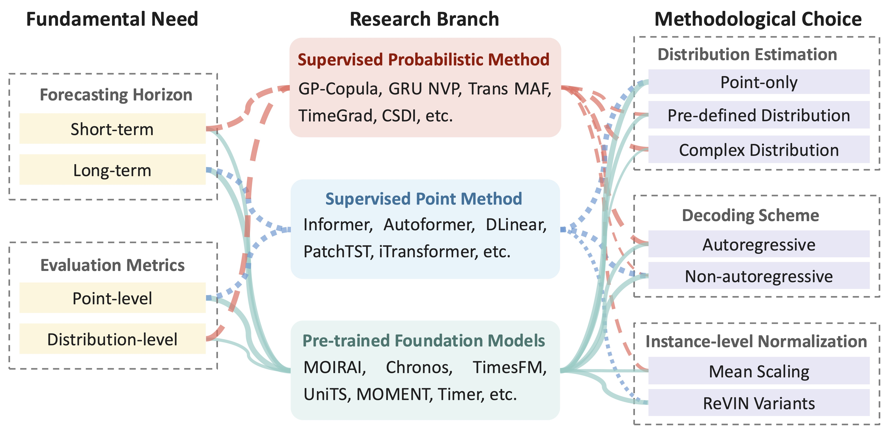

# Benchmarking :balance_scale:

Accurate point and distributional forecasts across diverse horizons are crucial for time-series forecasting. However, existing research often focuses on isolated aspects, such as long-term point forecasting or short-term probabilistic estimation. This raises a fundamental question: **How do different methodological designs address these diverse forecasting needs?**

In this repository, we:
1. **Provide Detailed Reproduction Guides:** Offer comprehensive instructions for replicating supervised models and pre-trained foundation models.
2. **Evaluate Methods Under a Unified Framework:** Align and assess existing methods across various data scenarios using a consistent benchmarking framework.
3. **Deliver In-Depth Insights:** Present detailed analyses and insights into the experimental results.

## Benchmarking Scripts

- [Supervised Forecasting Models](./supervised_model/README.md)
- [Pre-trained Time-Series Foundation Models](./foundation_model/README.md)

## Methodology Overview

