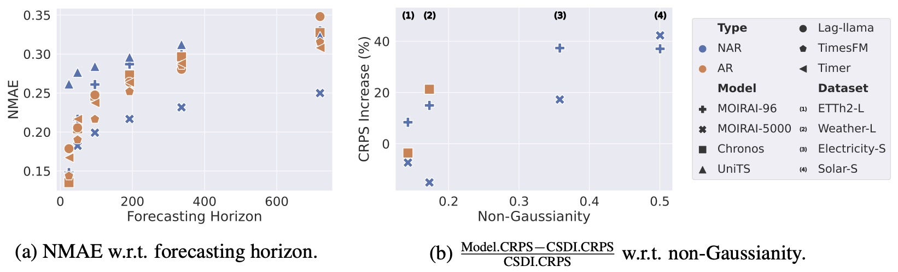
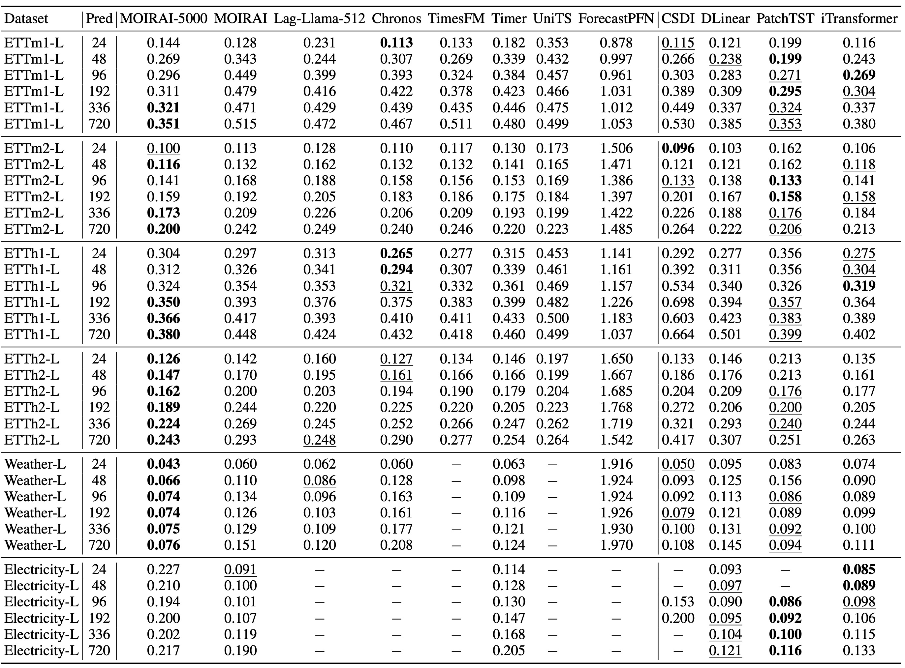
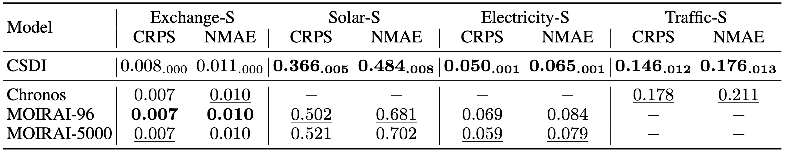

# Time Series Foundation Models Benchmarking

- [Time Series Foundation Models Benchmarking](#time-series-foundation-models-benchmarking)
  - [Foundation Models](#foundation-models)
    - [Overview](#overview)
    - [Results Reproduction](#results-reproduction)
  - [Key Insights \& Takeaways](#key-insights--takeaways)
  - [Experimental Results](#experimental-results)
    - [Comparison Across Horizons](#comparison-across-horizons)
    - [Short-term Probabilistic Forecasting](#short-term-probabilistic-forecasting)


## Foundation Models

### Overview

| Model | Backbone | Dec. | Varied Hor. | Dist. Head | Var. | Hyper-param in Inference | Running Guides |
| --- | --- | --- | --- | --- | --- | --- | --- |
| [Lag-Llama](https://github.com/time-series-foundation-models/lag-llama) | Dec-only Trans. | AR | √ | Student' t | Uni | `context len`, `pred len`, `use_rope_scaling` | [Details](./lag-llama.md) |
| [Chronos](https://github.com/amazon-science/chronos-forecasting) | Enc-Dec Trans. | AR | √ | Arbitrary | Uni | `context len`, `pred len`, `num_samples`, `temperature`, `top_k`, `top_p` | [Details](./chronos.md) |
| [TimesFM](https://github.com/google-research/timesfm) | Dec-only Trans. | AR | √ | - | Uni | `context len`, `frequency`, `window size` | [Details](./timesfm.md) |
| [Timer](https://github.com/thuml/Large-Time-Series-Model) | Dec-only Trans. | AR | √ | - | Uni | `context len`, `pred len`, `use_ims`  | [Details](./timer.md) |
| [MOIRAI](https://github.com/SalesforceAIResearch/uni2ts) | Enc-only Trans.  | NAR | √ | Mixture dist. | Multi | `context len`, `pred len`, `patch size`, `variate_mode` | [Details](./moirai.md) |
| [ForecastPFN](https://github.com/abacusai/ForecastPFN) | Enc-only Trans.  | NAR | √ | - | Uni | `context len`, `pred len` | [Details](./forecastpfn.md) |
| [UniTS](https://github.com/mims-harvard/UniTS) | Enc-only Trans.  | NAR | √ | - | Multi | `context len`, `pred len` | [Details](./units.md) |
| [Tiny Time Mixers](https://github.com/ibm-granite/granite-tsfm/tree/main/tsfm_public/models/tinytimemixer) | TSMixer | NAR | x | - | Multi | `context len`, `pred len` | [Details](./ttm.md) |

### Results Reproduction

For time-series foundation models, you need to install basic packages and additional dependencies:

**1. Set Up Environment**
```bash
# Create a new conda environment
conda create -n probts_fm python=3.10
conda activate probts_fm

# Git submodule
git submodule update --init --recursive

# Install additional packages for foundation models
pip install ".[tsfm]"
pip uninstall -y probts # recommended to uninstall the root package (optional)
```

**2. Initialize Submodules**

To running model MOIRAI, TimesFM, Lag-Llama and TinyTimeMixer, please run the following commands for submodules initialization.
```bash
# For MOIRAI, we fix the version of the package for better performance
cd submodules/uni2ts
git reset --hard fce6a6f57bc3bc1a57c7feb3abc6c7eb2f264301

# For TimesFM, fix the version for reproducibility (optional)
cd submodules/timesfm
git reset --hard 5c7b905

# For Lag-Llama, fix the version for reproducibility (optional)
cd submodules/lag_llama
git reset --hard 4ad82d9

# For TinyTimeMixer, fix the version for reproducibility (optional)
cd submodules/tsfm
git reset --hard bb125c14a05e4231636d6b64f8951d5fe96da1dc
```

**3. Download Model Checkpoints**

Download the necessary checkpoints (More details are available [here](./checkpoints/README.md)):
```bash
bash scripts/prepare_tsfm_checkpoints.sh
```
Note: By downloading, you agree to the original license terms. 

**4. Run Benchmarking:**

Reproduce the results reported in the ProbTS paper:

```bash 
bash scripts/reproduce_tsfm_results.sh
```

Configuration files are in [config/tsfm/](../../config/tsfm/).


**5. Experimental Results Analysis (Coming Soon)** :construction:

Analysis notebooks will be added in a future update.

## Key Insights & Takeaways

**1. Similar Insights in Evaluating Supervised Models Reconfirmed**

- Handling **Varied Forecasting Horizons:** Current AR-based time-series foundation models also encounter error accumulation problems.
- Addressing **Complex Data Distributions:** Predefined distribution heads lack the capability to fully capture complex data distributions.

**2. Supervised Time-Series Models vs. Pre-trained Foundation Models**
- There is no definitive winner yet!



**Takeaways:** 
- In practice, you may need to choose the right paradigm based on specific cases:
  - Unique data patterns → supervised models
  - Scarce training data → pre-trained models, etc.


## Experimental Results

### Comparison Across Horizons


Figure. We use a dashed line to denote the datasets on which the model was pre-trained, e.g., both TimesFM and MOIRAI have leveraged Traffic datasets for their pre-training. The ETT encompasses averaged results from datasets ETTh1, ETTh2, ETTm1, and ETTm2. 

Table 3. NMAE of time-series foundation models on diverse prediction horizons. The input sequence length is set to 96 if not specified. For every model, we exclude the evaluation results on its pre-trained datasets



### Short-term Probabilistic Forecasting

Table 4. Results of probabilistic foundation models on short-term distributional forecasting. For every model, we exclude the evaluation results on its pre-trained datasets.


