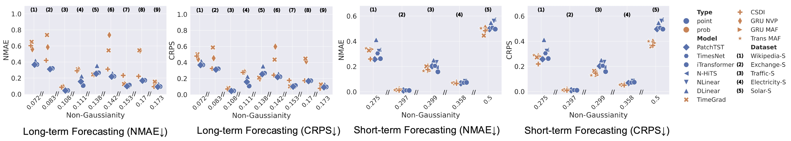
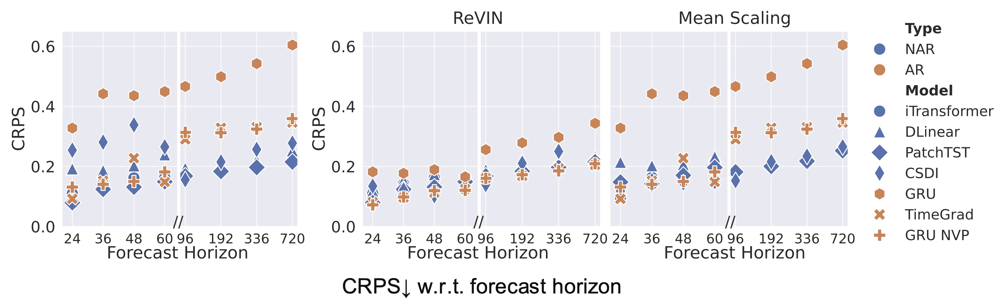
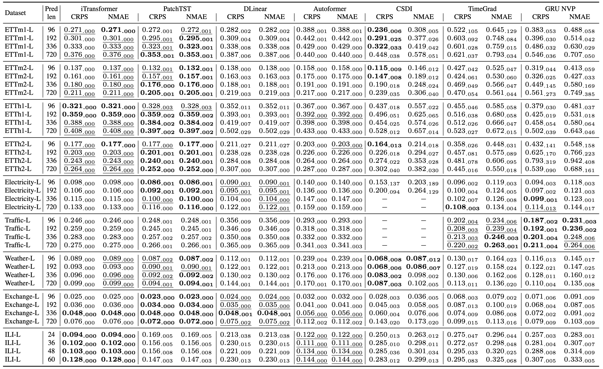
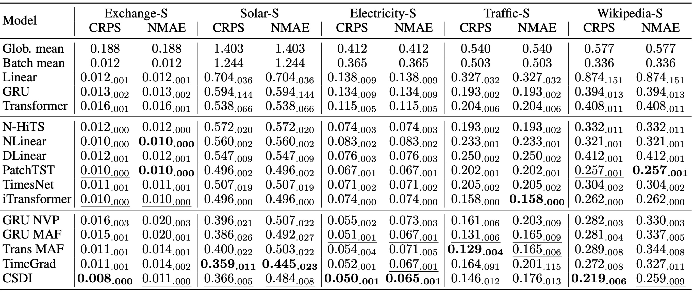

# Supervised Forecasting Models Benchmarking

- [Supervised Forecasting Models Benchmarking](#supervised-forecasting-models-benchmarking)
  - [Experimental Results Reproduction](#experimental-results-reproduction)
  - [Key Insights \& Takeaways](#key-insights--takeaways)
    - [Point vs. Probabilistic Estimation](#point-vs-probabilistic-estimation)
    - [Autoregressive vs. Non-autoregressive Decoding Scheme](#autoregressive-vs-non-autoregressive-decoding-scheme)
    - [Instance-level Normalization Choice](#instance-level-normalization-choice)
  - [Experimental Result Details](#experimental-result-details)


## Experimental Results Reproduction

Reproduce the experimental results using the provided scripts:

- **Long-Term Forecasting:**

```bash 
bash scripts/reproduce_ltsf_results.sh
```
Configuration files: [config/ltsf/](../../../config/ltsf/).

- **Short-Term Forecasting:**

```bash 
bash scripts/reproduce_stsf_results.sh
```

Configuration files: [config/stsf/](../../../config/stsf/).


## Key Insights & Takeaways

### Point vs. Probabilistic Estimation

**Insights**

- Current supervised long-term point forecasting models (e.g., DLinear, PatchTST, iTransformer) **struggle with intricate data distributions**.
- Current supervised short-term probabilistic forecasting models (e.g., GRU NVP, TimeGrad, CSDI) **face challenges in extended forecasting horizons**.




**Takeaways**
- It is important to consider both long-term and short-term evaluation scenarios.
- Leverage both point and distributional metrics for more comprehensive insights.


### Autoregressive vs. Non-autoregressive Decoding Scheme

**Insights**

- Current Supervised Non-Autoregressive (NAR) Models (e.g., PatchTST, iTransformer, CSDI)
  - Primarily developed for long-term forecasting scenarios.
  - **Suboptimal for short-term forecasting, and some models are memory-intensive.**
- Current Supervised Autoregressive (AR) Models (e.g., GRU, GRU NVP, TimeGrad)
  - Primarily developed for short-term forecasting scenarios
  - **Perform well with strong seasonality but struggle with long-term, strong trends**


**Takeaways**

- It is crucial to select the right **methodological design** based on the specific **data characteristics**.
- There are tremendous **re-design opportunities**, given the **comprehensive forecasting needs**.


### Instance-level Normalization Choice

**Insights**

- Reversible Instance Normalization (RevIN): Essential for Long-term Forecasting Scenarios
  - Our observation: **AR models in the literature are scarce for long-term forecasting**
  - Our finding: RevIN + AR => **A simple yet highly effective baseline that has been overlooked**
- Normalization Choices under Short-term Forecasting Scenarios
  - **No dominating normalization strategies**




**Takeaways**

- The **co-design** of **normalization** techniques and **model** architectures warrants further research attention.
- The **challenges and opportunities** in time-series normalization persist in balancing short-term and long-term forecasting needs.


## Experimental Result Details


**Long-Term Forecasting Benchmarking**


Table 1. Results ($\textrm{mean}_{\textrm{std}}$) on long-term forecasting scenarios with the best in $\textbf{bold}$ and the second $\underline{\textrm{underlined}}$, each containing five independent runs with different seeds. The input sequence length is set to 36 for the ILI-L dataset and 96 for the others. Due to the excessive time and memory consumption of CSDI in producing long-term forecasts, its results are unavailable in some datasets.




**Short-Term Forecasting Benchmarking**


Table 2.Results ($\textrm{mean}_{\textrm{std}}$) on short-term forecasting scenarios with the best in $\textbf{bold}$ and the second $\underline{\textrm{underlined}}$, each containing five independent runs with different seeds.




