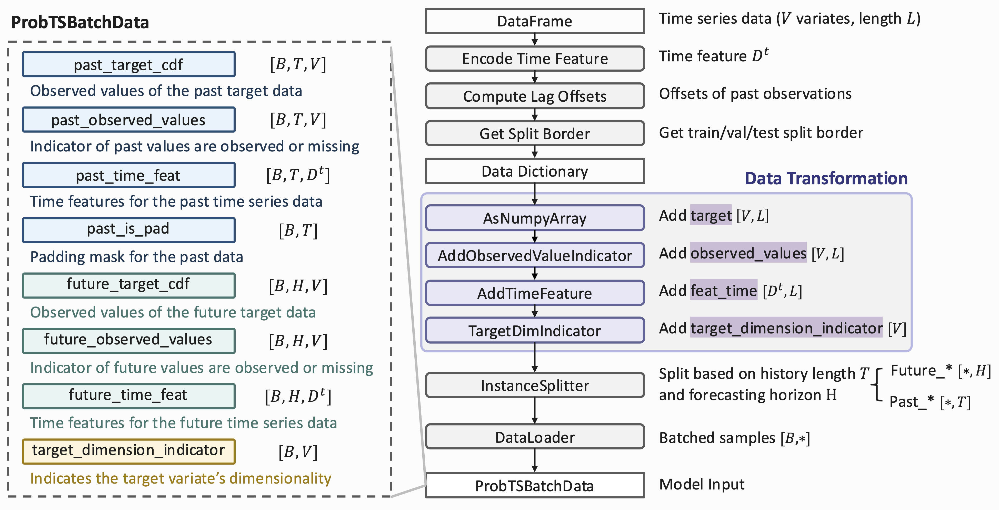

# Documentation :open_book:

- [Documentation :open\_book:](#documentation-open_book)
  - [Setup](#setup)
  - [Configuration Parameters](#configuration-parameters)
    - [Trainer](#trainer)
    - [Model](#model)
    - [Data](#data)
  - [Datasets](#datasets)
    - [Datasets Overview](#datasets-overview)
      - [Short-Term Setting](#short-term-setting)
      - [Long-Term Setting](#long-term-setting)
    - [Data Processing Pipeline](#data-processing-pipeline)
    - [Using Build-in Datasets](#using-build-in-datasets)
    - [Using Customized Dataset](#using-customized-dataset)
  - [Model](#model-1)
    - [Available Models](#available-models)
    - [Using Customized Model](#using-customized-model)
  - [Training](#training)
    - [Configuring Optimizers and Learning Rate Schedulers](#configuring-optimizers-and-learning-rate-schedulers)
  - [Forecasting with Varied Prediction Lengths](#forecasting-with-varied-prediction-lengths)
    - [Example 1: Varied-Horizon Training](#example-1-varied-horizon-training)
    - [Example 2: Validation and Testing with Multiple Horizons](#example-2-validation-and-testing-with-multiple-horizons)


## Setup

ProbTS is developed with Python 3.10 and relies on [PyTorch Lightning](https://github.com/Lightning-AI/lightning). To set up the environment:

```bash
# Create a new conda environment
conda create -n probts python=3.10
conda activate probts

# Install required packages
pip install .
pip uninstall -y probts # recommended to uninstall the root package (optional)
```

[Optional] For time-series foundation models, you need to install basic packages and additional dependencies:

```bash
# Create a new conda environment
conda create -n probts_fm python=3.10
conda activate probts_fm

# Git submodule
git submodule update --init --recursive

# Install additional packages for foundation models
pip install ".[tsfm]"
pip uninstall -y probts # recommended to uninstall the root package (optional)

# For MOIRAI, we fix the version of the package for better performance
cd submodules/uni2ts
git reset --hard fce6a6f57bc3bc1a57c7feb3abc6c7eb2f264301
```

<details>

<summary>Optional for TSFMs reproducibility</summary>

```bash
# For TimesFM, fix the version for reproducibility (optional)
cd submodules/timesfm
git reset --hard 5c7b905

# For Lag-Llama, fix the version for reproducibility (optional)
cd submodules/lag_llama
git reset --hard 4ad82d9

# For TinyTimeMixer, fix the version for reproducibility (optional)
cd submodules/tsfm
git reset --hard bb125c14a05e4231636d6b64f8951d5fe96da1dc
```

</details>


## Configuration Parameters 

- To print the full pipeline configuration to a file:

    ```bash
    python run.py --print_config > config/pipeline_config.yaml
    ```

### Trainer

| Config Name | Type | Description |
| --- | --- | --- |
| `trainer.max_epochs` | `int` | Maximum number of training epochs. |
| `trainer.limit_train_batches` | `int` | Limits the number of training batches per epoch. |
| `trainer.check_val_every_n_epoch` | `int` | Perform validation every n training epochs. |
| `trainer.default_root_dir` | `int` | Default path for logs and weights. |
| `trainer.accumulate_grad_batches` | `int` | Number of batches to accumulate gradients before updating. |

### Model

| Config Name | Type | Description |
| --- | --- | --- |
| `model.forecaster.class_path` | `str` | Forecaster module path (e.g., `probts.model.forecaster.point_forecaster.PatchTST`). |
| `model.forecaster.init_args.{ARG}` | - | Model-specific hyperparameters. |
| `model.num_samples` | `int` | Number of samples per distribution during evaluation. |
| `model.learning_rate` | `float` | Learning rate. |
| `model.quantiles_num` | `int` | Number of quantiles for evaluation. |
| `model.sampling_weight_scheme` | `str`  | The scheme of training horizon reweighting. Options: ['random', 'none', 'const'].|
| `model.optimizer_config.class_name` | `str` | optimizer module (e.g., `torch.optim.Adam`). |
| `model.optimizer_config.init_args.{ARG}` | - | optimizer hyperparameters. |
| `model.scheduler_config.class_name` | `str` | lr_scheduler module (e.g., `torch.optim.lr_scheduler.OneCycleLR`). |
| `model.scheduler_config.init_args.{ARG}` | - | lr_scheduler hyperparameters. |

### Data

| Config Name | Type | Description |
| --- | --- | --- |
| `data.data_manager.init_args.dataset` | `str` | Dataset for training and evaluation. |
| `data.data_manager.init_args.path` | `str` | Path to the dataset folder. |
| `data.data_manager.init_args.split_val` | `bool` | Whether to split a validation set during training. |
| `data.data_manager.init_args.scaler` | `str` | Scaler type: `identity`, `standard` (z-score normalization), or `temporal` (scale based on average temporal absolute value). |
| `data.data_manager.init_args.target_dim` | `int` | The number of variates. |
| `data.data_manager.init_args.var_specific_norm` | `bool` | If conduct per-variate normalization or not. |
| `data.data_manager.init_args.timeenc` | `int` | Time feature type. Select from `[0,1,2]`. See the explaination below for details. |
| `data.data_manager.init_args.context_length`    | `Union[str, int, list]`       | Length of observation window in inference phase. |
| `data.data_manager.init_args.prediction_length` | `Union[str, int, list]`       | Forecasting horizon length in inference phase. |
| `data.data_manager.init_args.val_pred_len_list` | `Union[str, int, list]`       | Forecasting horizon length for performance validation. |
| `data.data_manager.init_args.val_ctx_len`       | `Union[str, int, list]`      | Forecasting horizons for performance validation. |
| `data.data_manager.init_args.train_pred_len_list`| `Union[str, int, list]`      | Length of observation window in training phase. |
| `data.data_manager.init_args.train_ctx_len` | `Union[str, int, list]`      | Forecasting horizons in training phase. |
| `data.data_manager.init_args.continuous_sample`  | `bool` | If True, sampling horizons from `[min(train_pred_len_list), max(train_pred_len_list)]`, else sampling within the set `train_pred_len_list`.|
| `data.data_manager.init_args.test_rolling_length`  | `int` | `int` or `str` | Defines the gap window for rolling evaluations during testing. Defaults to `96` if not explicitly specified. If set to `auto`, the value is determined based on the dataset frequency: `{'h': 24, 'd': 7, 'b': 5, 'w': 4, 'min': 60}`. |
| `data.data_manager.init_args.train_ratio`  | `float` | Specifies proportion of the dataset used for training. Default value is 0.7.|
| `data.data_manager.init_args.test_ratio`  | `float` | Specifies proportion of the dataset used for training. Default value is 0.2.|
| `data.batch_size` | `int` | Batch size. |

**Temporal Features**

For the datasets used for long-term forecasting scenario, we support three types of time feature encoding

```bash
--data.data_manager.init_args.timeenc {the encoding type} # select from [0,1,2]
```

- **[timeenc 0] temporal information**

    The dimension of time feature is 5, containing `month, day, weekday, hour, minute`.

- **[timeenc 1] time feature based on frequency**
    Extract time feature using `time_features_from_frequency_str()` function. The dimensionality follows:
    ```bash
    freq_map = {'h': 4, 't': 5, 's': 6, 'm': 1, 'a': 1, 'w': 2, 'd': 3, 'b': 3}
    ```

    *Note: timeenc = 0 if model.embed != 'timeF' else 1.*

- **[timeenc 2] Raw date information**

    The dimension of time feature is 5, using the following code to recover it to date data type:
    ```bash
    data_stamp = batch_data.past_time_feat.cpu().numpy().astype('datetime64[s]')
    data_stamp = batch_data.future_time_feat.cpu().numpy().astype('datetime64[s]')
    ```

## Datasets

### Datasets Overview


#### Short-Term Setting

| Dataset | DATASET_NAME | Domain | Frequency | #Var | time steps | Description |
| --- | --- | --- | --- | --- | --- | --- |
| Exchange | `exchange_rate_nips` | Finance | Busi. Day | 8 | 6,071  | Daily exchange rates of 8 countries |
| Solar | `solar_nips` | Energy | H | 137 | 7,009 | Solar power production records |
| Electricity | `electricity_nips` | Energy | H | 370 | 5,833  | Electricity consumption |
| Traffic | `traffic_nips` | Transport | H | 963 | 4,001  | Road occupancy rates |
| Wikipedia | `wiki2000_nips` | Web | D | 2,000 | 792 | Page views of 2000 Wikipedia pages |

#### Long-Term Setting

| Dataset | DATASET_NAME | Domain | Frequency | #Var | time steps | Description |
| --- | --- | --- | --- | --- | --- | --- |
| ETTh | `etth1` / `etth2` | Energy | H | 7 | 17,420 | Electricity transformer temperature per hour |
| ETTm | `ettm1` / `ettm2` | Energy | 15min | 7 | 69,680  | Electricity transformer temperature every 15 min |
| Electricity | `electricity_lstf` | Energy | H | 321  | 26,304  | Electricity consumption (Kwh) |
| Weather | `weather_lstf` | Climate | 10min | 21 | 52,696  | Local climatological data |
| Traffic  | `traffic_ltsf` | Transport | H  | 862 | 17,544  | Road occupancy rates |
| Exchange | `exchange_ltsf` | Finance | Busi. Day | 8 | 7,588 | Daily exchange rates of 8 countries |
| ILI  | `illness_ltsf` | Epidemiology | W | 7 | 966 | Ratio of patients seen with influenza-like illness |
| Caiso | `caiso` | Energy | H | 10 | 74,472  | Electricity load series in different zones of California |
| Nordpool | `nordpool` | Energy | H | 18 | 70,128  | Energy production volume in European countries |
| Turkey Power | `turkey_power` | Energy | H | 18 | 26,304 | Electrical power demand in Turkey |
| Istanbul Traffic | `istanbul_traffic` | Transport | H | 3 | 14,244 | Traffic Index data for Istanbul traffic |


### Data Processing Pipeline

<div align=center>  </div>

### Using Build-in Datasets

- **Short-Term Forecasting**: We use datasets from [GluonTS](https://github.com/awslabs/gluonts). 
    Configure the datasets using `--data.data_manager.init_args.dataset {DATASET_NAME}` with available `DATASET_NAME` in [short-term setting](#short-term-setting).

- **Long-Term Forecasting**: To download the [long-term forecasting datasets](https://drive.google.com/drive/folders/1ZOYpTUa82_jCcxIdTmyr0LXQfvaM9vIy), please follow these steps:
    ```bash
    bash scripts/prepare_datasets.sh "./datasets"
    ```

    Configure the datasets using `--data.data_manager.init_args.dataset {DATASET_NAME}` with available `DATASET_NAME` in [long-term setting](#long-term-setting).

    *Note: When utilizing long-term forecasting datasets, you must explicitly specify the `context_length` and `prediction_length` parameters. For example, to set a context length of 96 and a prediction length of 192, use the following command-line arguments:*
    ```bash
    --data.data_manager.init_args.context_length 96 \
    --data.data_manager.init_args.prediction_length 192 \
    ```

- **Using Datasets from Monash Time Series Forecasting Repository**: To use datasets from the [Monash Time Series Forecasting Repository](https://forecastingdata.org/), follow these steps:

    1. **Download the Dataset**: 
    - Navigate to the target dataset, such as the [Electricity Hourly Dataset](https://zenodo.org/records/4656140).
    - Download the `.tsf` file and place it in your local `datasets` directory (e.g., `./datasets`).

    1. **Configure the Dataset**:
    - Use the following configuration to specify the dataset, file path, and frequency:
        ```bash
        --data.data_manager.init_args.dataset {DATASET_NAME} \
        --data.data_manager.init_args.data_path /path/to/data.csv \
        --data.data_manager.init_args.freq {FREQ} 
        ```

    - **Example Configuration**:
        ```bash
        --data.data_manager.init_args.dataset monash_electricity_hourly \
        --data.data_manager.init_args.data_path ./datasets/electricity_hourly_dataset.tsf \
        --data.data_manager.init_args.freq H \
        --data.data_manager.init_args.context_length 96 \
        --data.data_manager.init_args.prediction_length 96 \
        --data.data_manager.init_args.multivariate true
        ```

    *Note: Refer to the [Pandas Time Series Offset Aliases](https://pandas.pydata.org/pandas-docs/stable/user_guide/timeseries.html#timeseries-offset-aliases) for the correct frequency values (`{FREQ}`) to use in your configuration.*


- **Using Datasets from GIFT-EVAL Benchmarking**: see [this page](./docs/documentation/Gift_eval.md) for detailed instructions.


### Using Customized Dataset

1. **Prepare the Data**: 

- Format your dataset as a `.csv` file with the following structure:

  | date                | VAR1   | VAR2   | ... |
  |---------------------|--------|--------|-----|
  | 2013-01-01 00:00:00 | 2611.0 | 1539.0 | ... |
  | 2013-01-01 01:00:00 | 2132.0 | 1535.0 | ... |

  Note1: The date column represents timestamps.

  Note2: VAR1, VAR2, etc., represent different variables (features) for each timestamp.

- Place the csv file in your local `datasets` directory (e.g., `./datasets`).

1. **Configure the Dataset**:
- Use the following configuration to specify the dataset, file path, and frequency:
   ```bash
   --data.data_manager.init_args.dataset {DATASET_NAME} \
   --data.data_manager.init_args.data_path /path/to/data_file.tsf \
   --data.data_manager.init_args.freq {FREQ} 
   ```

- **Example Configuration**:
   ```bash
   --data.data_manager.init_args.dataset my_data \
   --data.data_manager.init_args.data_path ./datasets/my_data.csv \
   --data.data_manager.init_args.freq H \
   --data.data_manager.init_args.context_length 96 \
   --data.data_manager.init_args.prediction_length 96 \
   --data.data_manager.init_args.multivariate true
   ```

*Note: You can adjust the test instance sampling using the `--data.data_manager.init_args.test_rolling_length` parameter.*


## Model

### Available Models

ProbTS includes both classical time-series models, specializing in long-term point forecasting or short-term distributional forecasting, and recent time-series foundation models that offer zero-shot and arbitrary-horizon forecasting capabilities for new time series.

**Classical Time-series Models**

| **Model** | **Original Eval. Horizon** | **Estimation** | **Decoding Scheme** | **Class Path** |
| --- | --- | --- | --- | --- |
| Linear | - | Point | Auto / Non-auto | `probts.model.forecaster.point_forecaster.LinearForecaster` |
| [GRU](https://arxiv.org/abs/1412.3555) | - | Point | Auto / Non-auto | `probts.model.forecaster.point_forecaster.GRUForecaster` |
| [Transformer](https://arxiv.org/abs/1706.03762) | - | Point | Auto / Non-auto | `probts.model.forecaster.point_forecaster.TransformerForecaster` |
| [Autoformer](https://arxiv.org/abs/2106.13008) | Long-trem | Point | Non-auto | `probts.model.forecaster.point_forecaster.Autoformer` |
| [N-HiTS](https://arxiv.org/abs/2201.12886) | Long-trem | Point | Non-auto | `probts.model.forecaster.point_forecaster.NHiTS` |
| [NLinear](https://arxiv.org/abs/2205.13504) | Long-trem | Point | Non-auto | `probts.model.forecaster.point_forecaster.NLinear` |
| [DLinear](https://arxiv.org/abs/2205.13504) | Long-trem | Point | Non-auto | `probts.model.forecaster.point_forecaster.DLinear` |
| [TSMixer](https://arxiv.org/abs/2303.06053) | Long-trem | Point | Non-auto | `probts.model.forecaster.point_forecaster.TSMixer` |
| [TimesNet](https://arxiv.org/abs/2210.02186) | Short- / Long-term | Point | Non-auto | `probts.model.forecaster.point_forecaster.TimesNet` |
| [PatchTST](https://arxiv.org/abs/2211.14730) | Long-trem | Point | Non-auto | `probts.model.forecaster.point_forecaster.PatchTST` |
| [iTransformer](https://arxiv.org/abs/2310.06625) | Long-trem | Point | Non-auto | `probts.model.forecaster.point_forecaster.iTransformer` |
| [ElasTST](https://arxiv.org/abs/2411.01842) | Long-trem | Point | Non-auto | `probts.model.forecaster.point_forecaster.ElasTST` |
| [GRU NVP](https://arxiv.org/abs/2002.06103) | Short-term | Probabilistic | Auto | `probts.model.forecaster.prob_forecaster.GRU_NVP` |
| [GRU MAF](https://arxiv.org/abs/2002.06103) | Short-term | Probabilistic | Auto | `probts.model.forecaster.prob_forecaster.GRU_MAF` |
| [Trans MAF](https://arxiv.org/abs/2002.06103) | Short-term | Probabilistic | Auto | `probts.model.forecaster.prob_forecaster.Trans_MAF` |
| [TimeGrad](https://arxiv.org/abs/2101.12072) | Short-term | Probabilistic | Auto | `probts.model.forecaster.prob_forecaster.TimeGrad` |
| [CSDI](https://arxiv.org/abs/2107.03502) | Short-term | Probabilistic | Non-auto | `probts.model.forecaster.prob_forecaster.CSDI` |
| [TSDiff](https://arxiv.org/abs/2307.11494) | Short-term | Probabilistic | Non-auto | `probts.model.forecaster.prob_forecaster.TSDiffCond` |

**Fundation Models**

| **Model** | **Any Horizon** | **Estimation** | **Decoding Scheme** | **Class Path** | **Model Size** | 
| --- | --- | --- | --- | --- | --- |
| [Lag-Llama](https://arxiv.org/abs/2310.08278) | &#x2714; | Probabilistic | AR | `probts.model.forecaster.prob_forecaster.LagLlama` | - |
| [ForecastPFN](https://arxiv.org/abs/2311.01933) | &#x2714; | Point | NAR | `probts.model.forecaster.point_forecaster.ForecastPFN` | - |
| [TimesFM](https://arxiv.org/abs/2310.10688) | &#x2714; | Point | AR | `probts.model.forecaster.point_forecaster.TimesFM` | `200m`, `500m` |
| [TTM](https://arxiv.org/abs/2401.03955) | &#x2718; | Point | NAR | `probts.model.forecaster.point_forecaster.TinyTimeMixer` | - |
| [Timer](https://arxiv.org/abs/2402.02368) | &#x2714; | Point | AR | `probts.model.forecaster.point_forecaster.Timer` | - |
| [MOIRAI](https://arxiv.org/abs/2402.02592) | &#x2714; | Probabilistic | NAR | `probts.model.forecaster.prob_forecaster.Moirai` | `small`, `base`, `large` |
| [UniTS](https://arxiv.org/abs/2403.00131) | &#x2714; | Point | NAR | `probts.model.forecaster.point_forecaster.UniTS` | - |
| [Chronos](https://arxiv.org/abs/2403.07815) | &#x2714; | Probabilistic | AR | `probts.model.forecaster.prob_forecaster.Chronos` | `tiny`, `mini`, `small`, `base`, `large` |
| [Time-MoE](https://arxiv.org/abs/2409.16040) | &#x2714; | Point | AR | `probts.model.forecaster.point_forecaster.TimeMoE` | `50M`, `200M` |

See the [tsfm configuration directory](./config/tsfm/) for more details. More models will be added soon—stay tuned!


### Using Customized Model

With our platform, you can easily evaluate customized models across various datasets. Follow the steps below to create and evaluate your model.


**Step 1: Create a New Python File**

Create a new Python file and follow the structure below to define your custom model:

```python
from probts.model.forecaster import Forecaster

class ModelName(Forecaster):
    def __init__(
        self,
        **kwargs
    ):
        """
        Initialize the model with parameters.
        """
        super().__init__(**kwargs)
        # Initialize model parameters here

    def forward(self, inputs):
        """
        Forward pass for the model.

        Parameters:
        inputs [Tensor]: Input tensor for the model.

        Returns:
        Tensor: Output tensor.
        """
        # Perform the forward pass of the model
        return outputs

    def loss(self, batch_data):
        """
        Compute the loss for the given batch data.

        Parameters:
        batch_data [dict]: Dictionary containing input data and possibly target data.

        Returns:
        Tensor: Computed loss.
        """
        # Extract inputs and targets from batch_data
        inputs = batch_data.past_target_cdf[:, -self.context_length:, :] # [batch_size, context_length, var_num]
        target = batch_data.future_target_cdf # [batch_size, prediction_length, var_num]

        # Forward pass
        outputs = self.forward(inputs)
        
        # Calculate loss using a loss function, e.g., Mean Squared Error
        loss = self.loss_function(outputs, future_target_cdf)

        return loss

    def forecast(self, batch_data, num_samples=None):
        """
        Generate forecasts for the given batch data.

        Parameters:
        batch_data [dict]: Dictionary containing input data.
        num_samples [int, optional]: Number of samples per distribution during evaluation. Defaults to None.

        Returns:
        Tensor: Forecasted outputs.
        """
        # Perform the forward pass to get the outputs
        outputs = self(batch_data.past_target_cdf[:, -self.context_length:, :])

        if num_samples is not None:
            # If num_samples is specified, use it to sample from the distribution
            outputs = self.sample_from_distribution(outputs, num_samples)
        else: 
            # If perform point estimation, the num_samples is equal to 1
            outputs = outputs.unsqueeze(1)
        return outputs # [batch_size, num_samples, prediction_length, var_num]
```

  **Input Data Format**

  The `batch_data` dictionary contains several fields that provide necessary information for the model's operation. Each field is described below:

  - **`target_dimension_indicator`**: 
    - **Shape**: [var_num]
    - **Description**: Indicator that specifies which dimension or feature of the target is being referenced. 

  - **`{past|future}_time_feat`**: 
    - **Shape**: [batch_size,length,time_feature_dim]
    - **Description**: Time features associated with each time step in the past or future. This can include various time-related information such as timestamps, seasonal indicators (e.g., month, day of the week), or other temporal features that provide context to the observations.
  - **`{past|future}_target_cdf`**: 
    - **Shape**: [batch_size,length,var_num]
    - **Description**: The observation values of the target variable(s) for past or future time steps. 
  - **`{past|future}_observed_values`**: 
    - **Shape**: [batch_size,length,var_num]
    - **Description**: Binary masks indicating which values in the past or future target data are observed (1) and which are missing or unobserved (0). 

**Step 2: Create YAML Configuration File**

Create a YAML configuration file (`model.yaml`) for the customized model:

```yaml
seed_everything: 1 # random seed
trainer:
  accelerator: gpu
  devices: 1
  strategy: auto
  max_epochs: 50
  use_distributed_sampler: false
  limit_train_batches: 100
  log_every_n_steps: 1
  default_root_dir: ./results # path to the log folder
model:
  forecaster:
    class_path: class.path.to.ModelName
    init_args:
      # init your hyperparameter here
  learning_rate: 0.001 # learning rate
data:
  data_manager:
    class_path: probts.data.data_manager.DataManager
    init_args:
      dataset: solar_nips # dataset name
      split_val: true
      scaler: standard # identity, standard, temporal
  batch_size: 32
  test_batch_size: 32
  num_workers: 8
```

**Step 3: Run the Customized Model**

Run the customized model using the configuration file:

```bash
python run.py --config config/path/to/model.yaml
```


## Training


### Configuring Optimizers and Learning Rate Schedulers

ProbTS supports customizable optimizers and learning rate schedulers. You can specify them directly in the YAML configuration file.

**Example Configuration**
```yaml 
model:
  forecaster:
    class_path: probts.model.forecaster.point_forecaster.PatchTST
    init_args:
      # Add forecaster-specific parameters here

  optimizer_config:
    class_name: torch.optim.Adam
    init_args:
      weight_decay: 0  # Add optimizer-specific parameters here

  lr_scheduler_config:
    class_name: torch.optim.lr_scheduler.OneCycleLR
    init_args:
      max_lr: 0.0001
      steps_per_epoch: 100
      pct_start: 0.3
      epochs: 50  # Add scheduler-specific parameters here
```

Example configurations can be found in [config/default/patchtst.yaml](../../config/default/patchtst.yaml).

**Notes**

- If no configuration is provided, ProbTS defaults to the Adam optimizer with a constant learning rate.
- Adjust init_args for both the optimizer and scheduler to suit your specific use case.


## Forecasting with Varied Prediction Lengths


**Example:**
```bash 
python run.py --config config/multi_hor/elastst.yaml \
                --data.data_manager.init_args.path ./datasets \
                --trainer.default_root_dir /path/to/log_dir/ \
                --data.data_manager.init_args.dataset {DATASET_NAME} \
                --data.data_manager.init_args.context_length ${TEST_CTX_LEN} \
                --data.data_manager.init_args.prediction_length ${TEST_PRED_LEN} \
                --data.data_manager.init_args.train_ctx_len ${TRAIN_CTX_LEN} \
                --data.data_manager.init_args.train_pred_len_list ${TRAIN_PRED_LEN} \
                --data.data_manager.init_args.val_ctx_len ${VAL_CTX_LEN} \
                --data.data_manager.init_args.val_pred_len_list ${VAL_PRED_LEN} 
```

- `DATASET_NAME`: Select from datasets used in long-term forecasting scenerios.
- `TEST_CTX_LEN`: Context length in the testing phase.
- `VAL_CTX_LEN` (Default: `TEST_CTX_LEN`): Context length in the validation phase.
- `TRAIN_CTX_LEN` (Default: `TEST_CTX_LEN`): Context length in the training phase.
- `TEST_PRED_LEN`: Forecasting horizons in the testing phase.
- `VAL_PRED_LEN` (Default: `TEST_PRED_LEN`): Forecasting horizons for performance validation.
- `TRAIN_PRED_LEN` (Default: `TEST_PRED_LEN`): Forecasting horizons in the training phase.

The results across multiple horizons will be saved to: 
```bash 
/path/to/log_dir/{DATASET_NAME}_{MODEL}_{seed}_TrainCTX_{TRAIN_CTX_LEN}_TrainPRED_{TRAIN_PRED_LEN}_ValCTX_{CTX_LEN}_ValPRED_{VAL_PRED_LEN}/horizons_results.csv
```

### Example 1: Varied-Horizon Training

**Mode 1: Random sampling from a set of horizons**

```bash 
python run.py --config config/multi_hor/elastst.yaml \
                --data.data_manager.init_args.path ./datasets \
                --trainer.default_root_dir /path/to/log_dir/ \
                --data.data_manager.init_args.dataset ${DATASET} \
                --data.data_manager.init_args.context_length 96 \
                --data.data_manager.init_args.prediction_length 720 \
                --data.data_manager.init_args.train_ctx_len 96 \
                --data.data_manager.init_args.val_pred_len_list 720 \
                # random selection from {96, 192, 336, 720}
                --data.data_manager.init_args.train_pred_len_list 96-192-336-720 \
                --data.data_manager.init_args.continuous_sample false 
```

**Mode 2: Random sampling from a horizon range**

```bash 
python run.py --config config/multi_hor/elastst.yaml \
                --data.data_manager.init_args.path ./datasets \
                --trainer.default_root_dir /path/to/log_dir/ \
                --data.data_manager.init_args.dataset ${DATASET} \
                --data.data_manager.init_args.context_length 96 \
                --data.data_manager.init_args.prediction_length 720 \
                --data.data_manager.init_args.train_ctx_len 96 \
                --data.data_manager.init_args.val_pred_len_list 720 \
                # random sampling from [1, 720]
                --data.data_manager.init_args.train_pred_len_list 1-720 \ 
                --data.data_manager.init_args.continuous_sample true 
```

### Example 2: Validation and Testing with Multiple Horizons

```bash 
python run.py --config config/multi_hor/elastst.yaml \
                --data.data_manager.init_args.path ./datasets \
                --trainer.default_root_dir /path/to/log_dir/ \
                --data.data_manager.init_args.dataset ${DATASET} \
                --data.data_manager.init_args.context_length 96 \
                --data.data_manager.init_args.train_pred_len_list 720 \ 
                --data.data_manager.init_args.train_ctx_len 96 \
                # validation on {96, 192, 336, 720}
                --data.data_manager.init_args.val_pred_len_list 96-192-336-720 \
                # testing on {24, 96, 192, 336, 720, 1024}
                --data.data_manager.init_args.prediction_length 24-96-192-336-720-1024 
```
